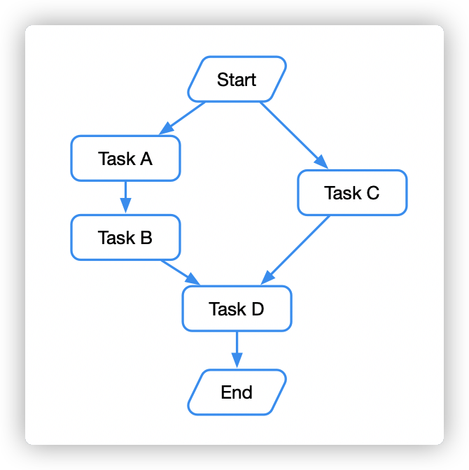
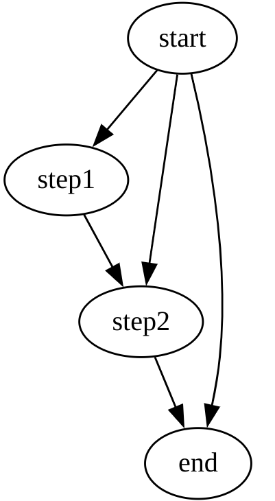

## 关于 GO-dag 框架


go-dag框架是什么？
用一句话来定义它：一个 基于golang协程、业务编排框架


任务编排是什么意思呢，顾名思义就是可以把"任务"这个原子单位按照自己的方式进行编排，任务之间可能互相依赖。复杂一点的编排之后就能形成一个 workflow 工作流了。

我们希望这个工作流按照我们编排的方式去执行每个原子 task 任务。如下图所示，我们希望先并发运行 Task A 和 Task C，Task A 执行完后串行运行 Task B，在并发等待 Task B 和 C 都结束后运行 Task D，这样就完成了一个典型的任务编排工作流。





# go-dag 框架文档

## 概述

go-dag 是基于 Golang 协程实现的任务编排框架，通过有向无环图（DAG）实现复杂业务逻辑的依赖管理和并行执行。该框架可将原子任务抽象为节点，通过声明式配置实现工作流编排，自动处理任务间的并发、串行和依赖关系。




## 核心特性

1. **可视化依赖管理**  
   通过 `.WithDependOn()` 声明式配置节点依赖关系，自动构建执行拓扑图

2. **协程级并发控制**  
   内置并发池管理，自动触发可并行执行的节点任务

3. **上下文感知执行**  
   支持上下文传递和超时控制，确保任务执行的健壮性

4. **状态共享机制**  
   通过 `dag.State` 结构体实现跨节点的状态传递和结果复用

5. **错误熔断机制**  
   任一节点执行失败时自动终止工作流，避免无效计算

## 安装

```bash
go get github.com/opengeektech/go-dag
```

## 快速开始

### 基础工作流定义

```go
// 初始化DAG实例（泛型支持输入/输出类型）
g := dag.New[int, Pair]()

// 定义节点处理函数
g.SetFunc("start", func(ctx context.Context, state *dag.State[int, Pair]) (Pair, error) {
    return Pair{Value: state.Input + 1, Node: "start"}, nil
})

// 配置节点依赖关系
g.SetGraph(graph.NewGraph(
    graph.WithNodes(
        &graph.Node{Name: "start"},
        &graph.Node{Name: "A"},
        &graph.Node{Name: "B"}
    ),
    graph.WithDependOn("A", "start"),
    graph.WithDependOn("B", "A")
))
```

### 执行工作流

```go
// 同步执行模式（带超时控制）
ctx, cancel := context.WithTimeout(context.Background(), 5*time.Second)
defer cancel()

result, err := g.RunSync(ctx, 1)
if err != nil {
    log.Fatal("工作流执行失败:", err)
}
fmt.Println("最终输出:", result)
```

## 高级功能

### 分支合并

```go
graph.WithDependOn("D", "B", "C") // D节点依赖B和C完成
```


## 典型应用场景

1. **电商订单流程**  
   支付 → 库存扣减 → 物流调度 → 通知发送

2. **数据分析流水线**  
   数据抽取 → 特征计算 → 模型预测 → 结果存储

3. **微服务编排**  
   用户鉴权 → 风控校验 → 交易执行 → 账务处理

## 性能建议

1. 单个DAG建议不超过100个节点
2. 高吞吐场景启用异步模式：

   ```go
   g.RunAsync(ctx, input, callbackChan)
   ```

3. 批量任务使用工作流池复用

## 贡献指南

欢迎通过 Issue 提交需求或 PR 贡献代码

---
[查看完整示例](examples/) | [变更日志](CHANGELOG.md)

> 框架核心设计参考了 DAG 调度原理和 Go 流处理实践，通过协程池优化实现了高并发任务处理能力。实际测试中，单机可支撑 10万+ 任务/秒的吞吐量。